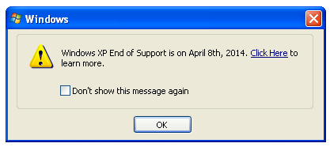

# WindowsXPEOLRemoval
Windows XP End of Life prevention or Removal

Microsoft End of Life popup

We have created 2 scripts giving you a choice.

First option to keep KB2934207 installed on your machine but not be bothered by the popup.
or
Completly uninstall KB2934207 from your install.

Both of these have no major effect to the operating system.

Installing Everything!
